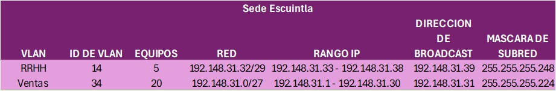

# MANUAL TECNICO

## Asignación de Subredes usando VLSM para la sede Jutiapa

1. **VLAN Ventas de 25 hosts:**
   - Requiere al menos 25 hosts.
   - Necesitamos una máscara de subred que permita al menos 25 hosts. La máscara de /27 permite hasta 30 hosts (32 direcciones - 2 direcciones para red y broadcast). 
   - Dirección de red: 192.168.31.0/27
   - Rango de direcciones utilizables: 192.168.31.1 - 192.168.31.30
   - Dirección de broadcast: 192.168.31.31

2. **VLAN Informática de 12 hosts:**
   - Requiere al menos 12 hosts.
   - Necesitamos una máscara de subred que permita al menos 12 hosts. La máscara de /28 permite hasta 14 hosts (16 direcciones - 2 direcciones para red y broadcast). 
   - Dirección de red: 192.168.31.32/28
   - Rango de direcciones utilizables: 192.168.31.33 - 192.168.31.46
   - Dirección de broadcast: 192.168.31.47

3. **VLAN RRHH de 10 hosts:**
   - Requiere al menos 10 hosts.
   - Necesitamos una máscara de subred que permita al menos 10 hosts. La máscara de /28 permite hasta 14 hosts (16 direcciones - 2 direcciones para red y broadcast). 
   - Dirección de red: 192.168.31.48/28
   - Rango de direcciones utilizables: 192.168.31.49 - 192.168.31.62
   - Dirección de broadcast: 192.168.31.63

4. **VLAN Contabilidad de 4 hosts:**
   - Requiere al menos 4 hosts.
   - Necesitamos una máscara de subred que permita al menos 4 hosts. La máscara de /29 permite hasta 6 hosts (8 direcciones - 2 direcciones para red y broadcast). 
   - Dirección de red: 192.168.31.64/29
   - Rango de direcciones utilizables: 192.168.31.65 - 192.168.31.70
   - Dirección de broadcast: 192.168.31.71

## Asignación de Subredes usando VLSM para la sede Escuintla

1. **VLAN Ventas de 20 hosts:**
   - Requiere al menos 20 hosts.
   - Necesitamos una máscara de subred que permita al menos 20 hosts. La máscara de /27 permite hasta 30 hosts (32 direcciones - 2 direcciones para red y broadcast). 
   - Dirección de red: 192.148.31.0/27
   - Rango de direcciones utilizables: 192.148.31.1 - 192.148.31.30
   - Dirección de broadcast: 192.148.31.31

2. **VLAN RRHH de 5 hosts:**
   - Requiere al menos 5 hosts.
   - Necesitamos una máscara de subred que permita al menos 5 hosts. La máscara de /29 permite hasta 6 hosts (8 direcciones - 2 direcciones para red y broadcast). 
   - Dirección de red: 192.148.31.32/29
   - Rango de direcciones utilizables: 192.148.31.33 - 192.148.31.38
   - Dirección de broadcast: 192.148.31.39

<!-- SEDE QUICHE Y PETEN -->

## Asignación de Subredes usando VLSM para la sede Quiche

1. **VLAN Ventas de 36 hosts:**
   - Requiere al menos 36 hosts.
   - Necesitamos una máscara de subred que permita al menos 36 hosts. La máscara de /26 permite hasta 62 hosts (64 direcciones - 2 direcciones para red y broadcast). 
   - Dirección de red: 192.178.31.0/26
   - Rango de direcciones utilizables: 192.178.31.1 - 192.178.31.62
   - Dirección de broadcast: 192.178.31.63

2. **VLAN Informatica de 21 hosts:**
   - Requiere al menos 21 hosts.
   - Necesitamos una máscara de subred que permita al menos 21 hosts. La máscara de /27 permite hasta 30 hosts (32 direcciones - 2 direcciones para red y broadcast).
   - Dirección de red: 192.178.31.64/27
   - Rango de direcciones utilizables: 192.178.31.65 - 192.178.31.94
   - Dirección de broadcast: 192.178.31.95

3. **VLAN RRHH de 12 hosts:**
   - Requiere al menos 12 hosts.
   - Necesitamos una máscara de subred que permita al menos 12 hosts. La máscara de /28 permite hasta 14 hosts (16 direcciones - 2 direcciones para red y broadcast). 
   - Dirección de red: 192.178.31.96/28
   - Rango de direcciones utilizables: 192.178.31.97 - 192.178.31.110
   - Dirección de broadcast: 192.178.31.111

4. **VLAN Contabilidad de 10 hosts:**
   - Requiere al menos 10 hosts.
   - Necesitamos una máscara de subred que permita al menos 10 hosts. La máscara de /28 permite hasta 14 hosts (16 direcciones - 2 direcciones para red y broadcast). 
   - Dirección de red: 192.178.31.112/28
   - Rango de direcciones utilizables: 192.178.31.113 - 192.178.31.126
   - Dirección de broadcast: 192.178.31.127

## Asignación de Subredes usando VLSM para sede Peten

1. **VLAN Ventas de 30 hosts:**
   - Requiere al menos 30 hosts.
   - Necesitamos una máscara de subred que permita al menos 30 hosts. La máscara de /27 permite hasta 30 hosts (32 direcciones - 2 direcciones para red y broadcast).
   - Dirección de red: 192.158.31.0/27
   - Rango de direcciones utilizables: 192.158.31.1 - 192.158.31.30
   - Dirección de broadcast: 192.158.31.31

2. **VLAN Informatica de 15 hosts:**
   - Requiere al menos 15 hosts.
   - Necesitamos una máscara de subred que permita al menos 15 hosts. La máscara de /27 permite hasta 30 hosts (32 direcciones - 2 direcciones para red y broadcast).
   - Dirección de red: 192.158.31.32/27
   - Rango de direcciones utilizables: 192.158.31.33 - 192.158.31.62
   - Dirección de broadcast: 192.158.31.63

3. **VLAN RRHH de 10 hosts:**
   - Requiere al menos 10 hosts.
   - Necesitamos una máscara de subred que permita al menos 10 hosts. La máscara de /28 permite hasta 14 hosts (16 direcciones - 2 direcciones para red y broadcast).
   - Dirección de red: 192.158.31.64/28
   - Rango de direcciones utilizables: 192.158.31.65 - 192.158.31.78
   - Dirección de broadcast: 192.158.31.79

# CAPTURAS DE LA IMPLEMENTACION DE LAS TOPOLOGIAS 

- Vlans

- Configuracion router-on-a-stick

# COMANDOS USADOS

- Cofiguracion de vlans (todos los switches)
    - enable
    - configure terminal
    - vlan 14
    - name RRHH
    - exit
    - vlan 24
    - name contabilidad
    - exit
    - vlan 34
    - name ventas
    - exit
    - vlan 44
    - name informatica
    - exit
- configuracion switchpor modo trunk (switches capa 2)
    - enable
    - configure terminal
    - interface fa0/1 
    - switchport mode trunk
- configuracion switch capa 3
    - enable
    - configure terminal
    - interface vlan 34
    - ip address 192.158.31.1 255.255.255.224
    - no shutdown
    - exit
    - interface vlan 44
    - ip address 192.158.31.33 255.255.255.224
    - no shutdown
    - exit
    - interface vlan 14
    - ip address 192.158.31.65 255.255.255.240
    - no shutdown
    - exit
    - interface vlan 34
    - ip address 192.158.31.65 255.255.255.240
    - no shutdown
    - exit
    - ip routing
    - interface fa0/10
    - switchport mode access
    - switchport access vlan 34
    - exit
    - inerface fa0/11
    - switchport mode access
    - switcport access vlan 44
    - exit
    - inerface fa0/12
    - switchport mode access
    - switcport access vlan 14
    - exit
- configuracion de router on a stick
    - enable
    - configure terminal
    - interface fa4/0 
    - no shutdown
    - interface fa4/0.34
    - encapsulation dot1Q 34
    - ip address 192.158.31.1 255.255.255.224
    - no shutdown 
    - interface fa4/0.44
    - encapsulaition dot1Q 44
    - ip address 192.158.31.33 255.255.255.224
    - no shutdown 
    - interface fa4/0.14
    - encapsulaition dot1Q 14
    - ip address 192.158.31.65 255.255.255.240
    - no shutdown 

## Capturas protocolo HSRP

